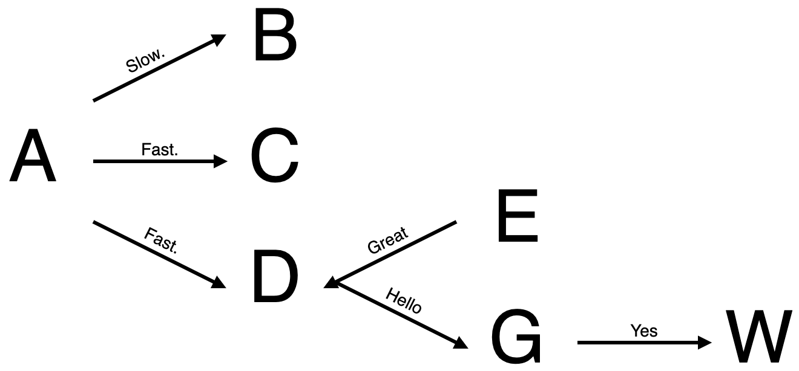

# Draw 4 Me (Auto Draw)

The below script uses a simplified syntax to draw simple charts and
arrows with emojis and icons. The goal would be for the emojis and/or icons
to be supplied by third-party components such as the noun project. Other ideas
include the concept to use ChatGPT to take a story and create a summary picture.

## Syntax

The syntax is similar to [ZenUML](https://mermaid.js.org/syntax/zenuml.html) which is used in Mermaid syntax. The example syntax below, will produce a chart similar to below.

```draw4me
A -> B: Slow.
A -> C, D: Fast.
E -> D: Great
D -> G: Hello
G -> W: Yes 
```



Further, the syntax below displays the image below.

```draw4me
🏝️ -> 🎟️: Conn 1.
🏝️ -> 🚀, 🎽: Fast!
🐉 -> 🎽: Great
```


You can also abbreviate the nodes and give them their own labels:

```draw4me
A = 😘: hi
B = ❤️: hi
C = ♠️: spade
A -> B: Slow.
A -> C, D: Fast.
E -> D: Great
D -> G: Hello
G -> W: Yes
```


You can also use [Font Awesome](https://fontawesome.com/) to draw icons by pre-pending the tag with fa-.

```draw4me
A = fa-wrench:
B = fa-wine-bottle: Red Red Wine
C = 🍔: Paradise
A -> B: Slow.
A -> C, D: Fast.
E -> D: Great
D -> G: Hello
G -> W: Yes
```


The diagram could be as simple as below:

```draw4me
A = Boy
B = Unicorn
A -> B: becomes
```


Or with some emojis

```draw4me
👦 = Boy
🦄 = Unicorn
👦 -> 🦄: becomes
```


## ToDo

- The math for the arrows is slightly off. We should use the angle of between the two boxes of the grid to determine the best fit line.
- The arrowhead needs to be pulled back within the bounding box. If you turn on the grid by setting 'showGrid', you can see how the arrows stretches across the box.
- Integrate [Linear Icons](https://linearicons.com/). It would be cool to do something like [ligatures](https://linearicons.com/#liga-font)
- Give the ability to box the nodes and do it in a theme similar to AWS or Azure.
- Give the option to do numbered connections rather than text above arrows.
